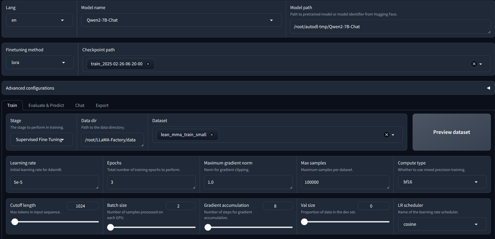
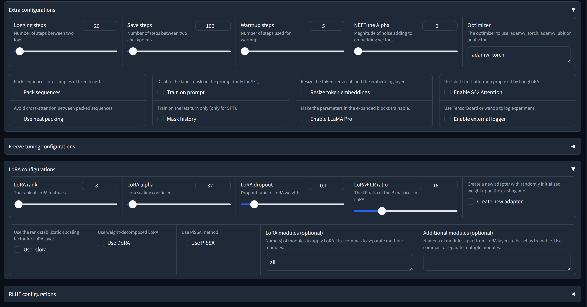
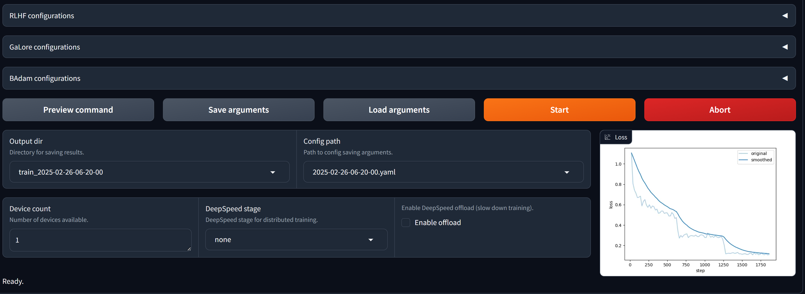
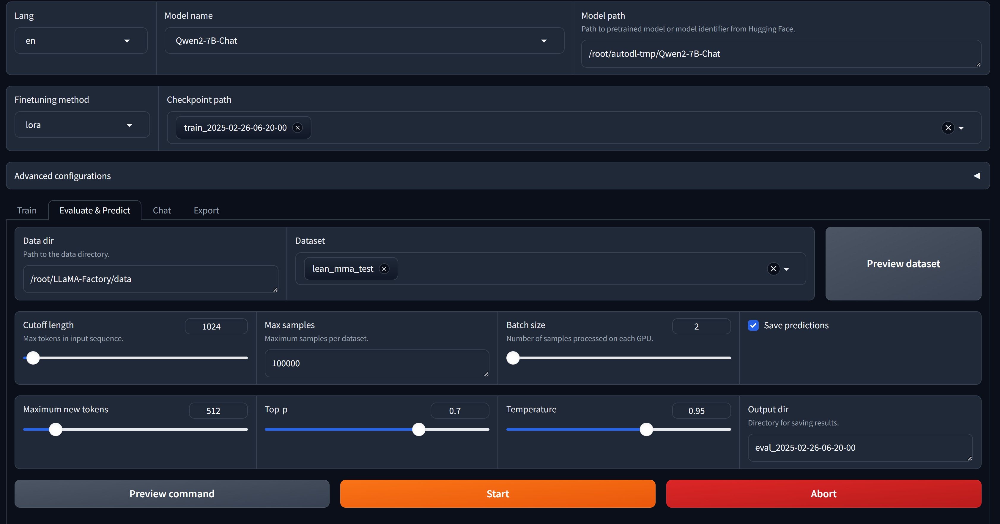
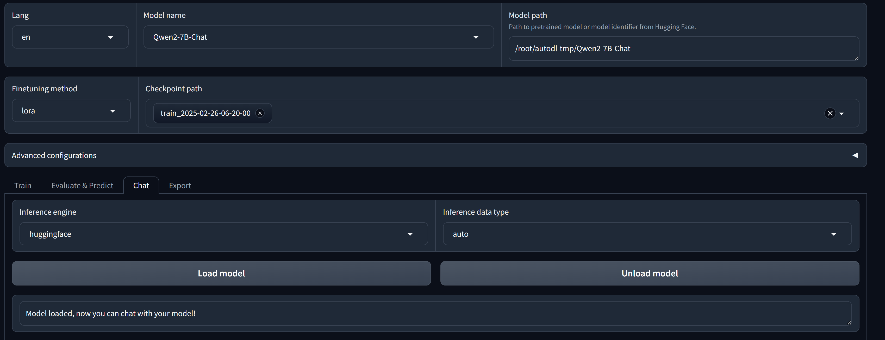
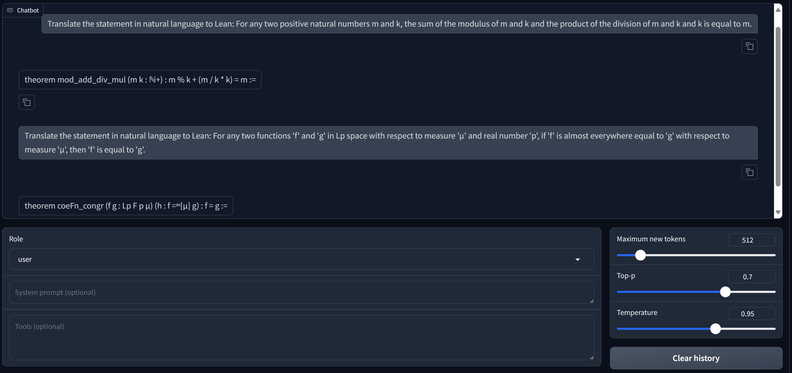

# Topic: Machine Learning Tools
1. Preparation Work
    - Install [Ollama](https://ollama.com/download/windows).  
    - Install [unsloth](https://github.com/unslothai/unsloth).  or LlamaFactory/msSWIFT
        ```
        pip install unsloth
        pip install --force-reinstall --no-cache-dir --no-deps git+https://github.com/unslothai/unsloth.git
        ```
    - Register wandb: Tracking weights and biases  
      ```API key: 3deb8692feb2708901e7736f6ffad392d38dfa63```  
    - Model download  
        ```
        pip install huggingface_hub
        mkdir ./DeepSeek-r1-Distill-Qwen-7B # Model storage address
        huggingface-cli download deepseek-ai/DeepSeek-R1-Distill-Qwen-7B --local-dir ./DeepSeek-r1-Distill-Qwen-7B # Download the model from the huggingface corresponding URL to the local corresponding address
        ```
        Or use git as an alternative:
        ```
        git clone https://huggingface.co/deepseek-ai/DeepSeek-R1-Distill-Qwen-7B ./DeepSeek-R1-Distill-Qwen-7B
        ```

llamafactory-cli webui  

**Training**




**Evaluate**


**Predict Metrics**  
  predict_bleu-4                 =    72.7232  
  predict_model_preparation_time =     0.0052  
  predict_rouge-1                =    84.8184  
  predict_rouge-2                =    67.9496  
  predict_rouge-l                =    78.9673  
  predict_runtime                = 0:23:29.46  
  predict_samples_per_second     =      1.367  
  predict_steps_per_second       =      0.684  

**Case Study**  

