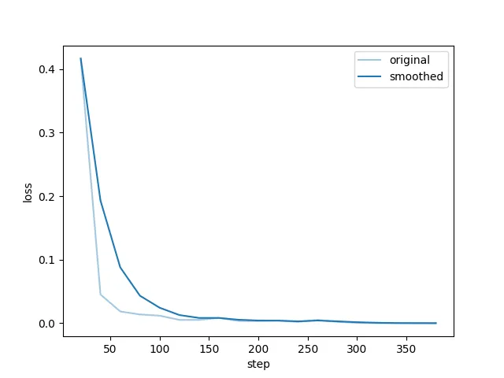
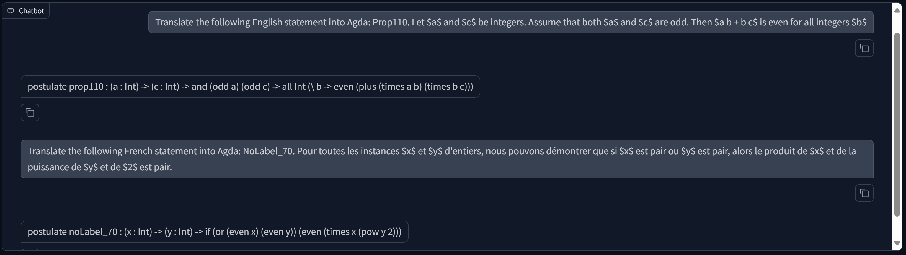
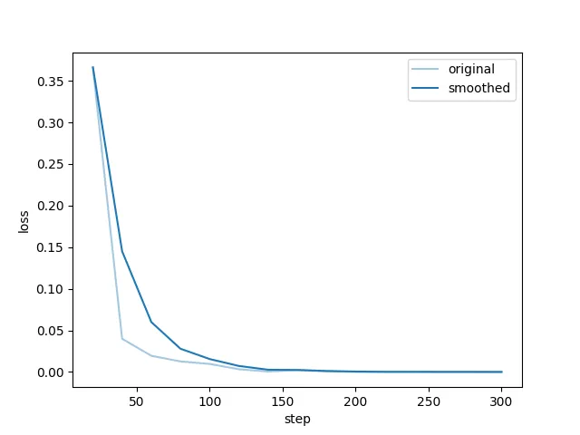
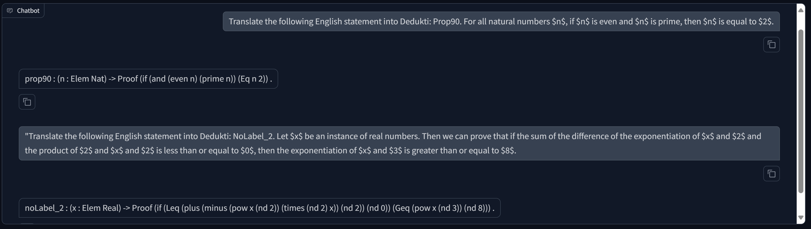
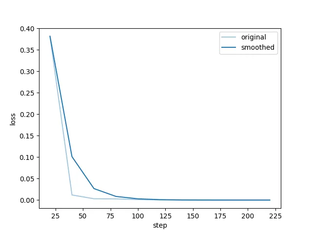
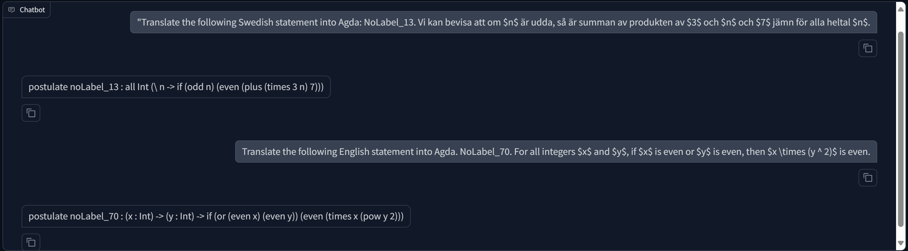
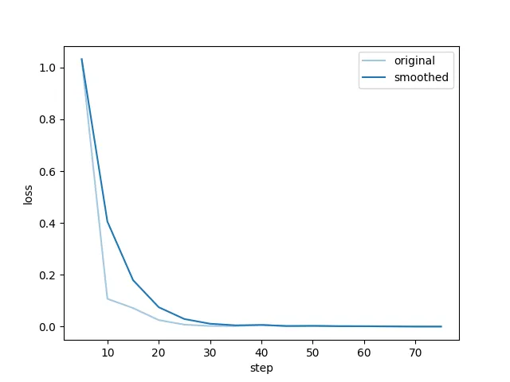
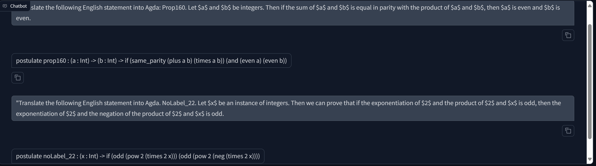
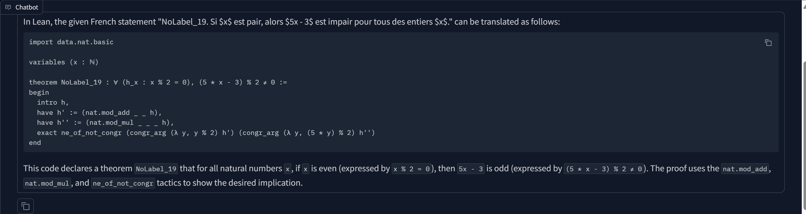

- **With All Formal Language and All Nature Language** 
**Training**

**Evaluate**  
"predict_bleu-4": 100.0,  
"predict_model_preparation_time": 0.0043,  
"predict_rouge-1": 100.0,  
"predict_rouge-2": 100.0,  
"predict_rouge-l": 100.0,  
"predict_runtime": 488.6772,  
"predict_samples_per_second": 1.772,  
"predict_steps_per_second": 0.886  
**Case Stduy**

- **With All Formal Language and English Only**
**Training**

**Evaluate**  
"predict_bleu-4": 100.0,  
"predict_model_preparation_time": 0.0042,  
"predict_rouge-1": 100.0,  
"predict_rouge-2": 100.0,  
"predict_rouge-l": 100.0,  
"predict_runtime": 158.6921,  
"predict_samples_per_second": 1.821,  
"predict_steps_per_second": 0.914  
**Case Stduy**

- **With Agda Only and All Nature Language** 
**Training**

**Evaluate**  
"predict_bleu-4": 100.0,  
"predict_model_preparation_time": 0.0041,  
"predict_rouge-1": 100.0,  
"predict_rouge-2": 100.0,   
"predict_rouge-l": 100.0,  
"predict_runtime": 122.7944,  
"predict_samples_per_second": 1.767,  
"predict_steps_per_second": 0.888  
**Case Stduy**

- **With Agda Only and English Only** 
**Training**

**Evaluate**   
"predict_bleu-4": 99.75275753424657,  
"predict_model_preparation_time": 0.0042,  
"predict_rouge-1": 99.90215205479453,  
"predict_rouge-2": 99.5433794520548,  
"predict_rouge-l": 99.7661205479452,  
"predict_runtime": 41.7802,  
"predict_samples_per_second": 1.747,  
"predict_steps_per_second": 0.886  
**Case Stduy**

- **Base Line**  
**Evaluate**  
    "predict_bleu-4": 6.442691916859122,  
    "predict_model_preparation_time": 0.006,  
    "predict_rouge-1": 25.68689907621247,  
    "predict_rouge-2": 10.06214665127021,  
    "predict_rouge-l": 15.772690184757506,  
    "predict_runtime": 3983.4854,  
    "predict_samples_per_second": 0.217,  
    "predict_steps_per_second": 0.109   
**Case Stduy**  
  
**Evaluate (base on exx-gflean_base_test.json, 866)**  
    "predict_bleu-4": 49.10165150115473,  
    "predict_model_preparation_time": 0.0046,  
    "predict_rouge-1": 68.58384168591223,  
    "predict_rouge-2": 42.13732713625866,  
    "predict_rouge-l": 61.680377598152425,  
    "predict_runtime": 555.2538,  
    "predict_samples_per_second": 1.56,  
    "predict_steps_per_second": 0.78  

Translate the following English statement into Lean. NoLabel_19. For all integers $x$, if $x$ is even, then the difference of the product of $5$ and $x$ and $3$ is odd.  
Please imitate the input and output examples and output in the specified format. Give me the output only.  
Example1:  
Input: Translate the following French statement into Coq. Prop70. Nous pouvons démontrer que $1$ est impair.  
Output: Axiom prop70 : odd 1 .  
Example2:  
Input: Translate the following English statement into Agda. Prop80. We can prove that $2$ is even.  
Output: postulate prop80 : even 2  

Groud Turth (Lean): axiom noLabel_19 : ∀ x : Int, (even x → odd (5 * x - 3))  
Groud Turth (Agda): postulate noLabel_19 : all Int (\\ x -> if (even x) (odd (minus (times 5 x) 3)))  
Groud Turth (Dedukti): noLabel_19 : Proof (forall Int (x => if (even x) (odd (minus (times (nd 5) x) (nd 3)))))  
Groud Turth (Coq): Axiom noLabel_19 : forall x : Int, (even x -> odd (5 * x - 3))  

Model output (Lean): Axiom NoLabel_19 : ∀ x -> (even x -> odd ((5 * x) - 3))
Model output (Agda): Axiom noLabel_19 : {x : Int} -> (even x) -> odd ((5 * x) - 3) .  
Model output (Dedukti): axiom NoLabel_19 : ∀ x -> (even x) → odd (minus (times 5 x) 3)  
Model output (Coq): Axiom NoLabel_19 : forall (x : int), even x -> odd (-(mult (s O) x) - s O).  