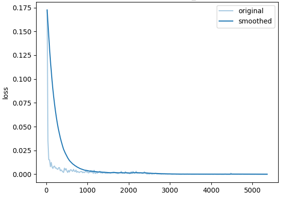
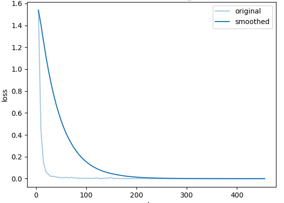
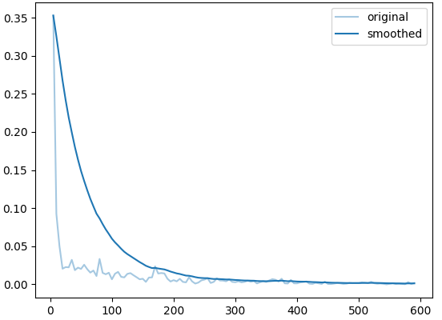
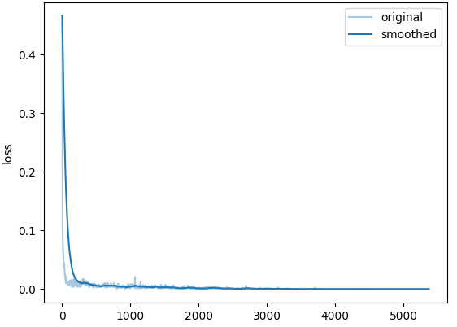
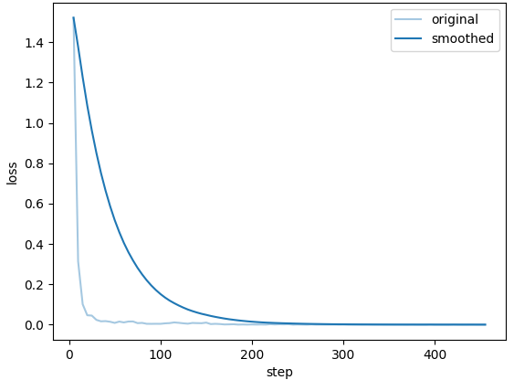
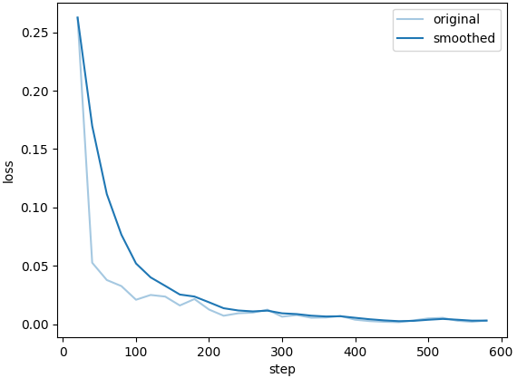
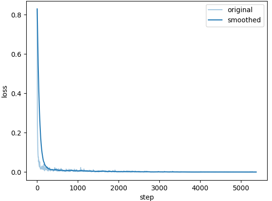
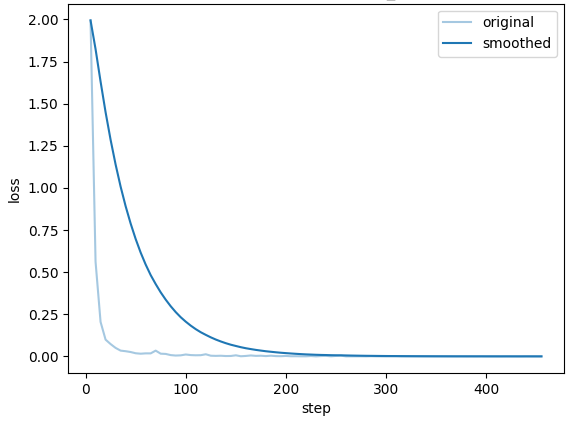

**Base Model Qwen2.5-7B-Base**  
- **Base Line**   
**On full_data_base_test_agda_eng_single (351)**   
    "predict_bleu-4": 51.19749373219373,  
    "predict_model_preparation_time": 0.0047,  
    "predict_rouge-1": 75.08338774928774,  
    "predict_rouge-2": 53.35914900284901,  
    "predict_rouge-l": 60.117741880341875,  
    "predict_runtime": 1310.4267,  
    "predict_samples_per_second": 0.268,  
    "predict_steps_per_second": 0.134  

- **Full Data with Agda and Single English Expressions Only (3154)**   
**Training**  
  
**Evaluation**  
**On full_data_test_agda_eng_single (351)：**  
    "predict_bleu-4": 98.61656381766382,  
    "predict_model_preparation_time": 0.0042,  
    "predict_rouge-1": 99.44990541310541,  
    "predict_rouge-2": 99.10784985754987,  
    "predict_rouge-l": 98.94666524216525,  
    "predict_runtime": 1005.1653,  
    "predict_samples_per_second": 0.349,  
    "predict_steps_per_second": 0.175  
**On full_data_test_agda_small (1000)：**  
    "predict_bleu-4": 94.8452257,  
    "predict_model_preparation_time": 0.0043,  
    "predict_rouge-1": 97.2225797,  
    "predict_rouge-2": 95.79734479999999,  
    "predict_rouge-l": 96.593594,  
    "predict_runtime": 3142.9208,  
    "predict_samples_per_second": 0.318,  
    "predict_steps_per_second": 0.159  
**On checked_full_eng_agda (697)：**  
    "predict_bleu-4": 24.117369870875176,  
    "predict_model_preparation_time": 0.0043,  
    "predict_rouge-1": 71.26545136298422,  
    "predict_rouge-2": 41.684456958393106,  
    "predict_rouge-l": 53.26979971305595,  
    "predict_runtime": 452.837,  
    "predict_samples_per_second": 1.539,  
    "predict_steps_per_second": 0.771  
- **Full Data with Agda and all English Expressions (28656)**   
**Training**  
  
**Evaluation**  
**On full_data_test_agda_eng (3185)：**  
    "predict_bleu-4": 99.294073155416,  
    "predict_model_preparation_time": 0.0045,  
    "predict_rouge-1": 99.92347880690738,  
    "predict_rouge-2": 99.87280028257457,  
    "predict_rouge-l": 99.60355918367347,  
    "predict_runtime": 9995.9989,  
    "predict_samples_per_second": 0.319,  
    "predict_steps_per_second": 0.159  
**On checked_full_eng_agda (697)：**  
    "predict_bleu-4": 26.310961549497847,  
    "predict_model_preparation_time": 0.0044,  
    "predict_rouge-1": 73.7629981348637,  
    "predict_rouge-2": 44.949751219512194,  
    "predict_rouge-l": 55.53361391678622,  
    "predict_runtime": 514.5276,  
    "predict_samples_per_second": 1.355,  
    "predict_steps_per_second": 0.678  

- **Checked Dataset with Last English Expression as Testset (2460)**   
**Training**  
  
**Evaluation**  
**On checked_test_eng_lastsplit (328)：**  
    "predict_bleu-4": 98.4393649390244,  
    "predict_model_preparation_time": 0.0044,  
    "predict_rouge-1": 98.83111646341465,  
    "predict_rouge-2": 97.86907713414634,  
    "predict_rouge-l": 98.79768201219512,  
    "predict_runtime": 342.9787,  
    "predict_samples_per_second": 0.956,  
    "predict_steps_per_second": 0.478  

----------------------------------------------------------
**Base Model Meta-Llama-3.1-8B**  
- **Base Line**  
**On full_data_base_test_agda_eng_single (351)**   
N/A

- **Full Data with Agda and Single English Expressions Only (3154)**   
**Training**  
  
**Evaluation**  
**On full_data_test_agda_eng_single (351)：**  
    "predict_bleu-4": 98.66765099715099,  
    "predict_model_preparation_time": 0.005,  
    "predict_rouge-1": 99.42804558404558,  
    "predict_rouge-2": 99.09663304843305,  
    "predict_rouge-l": 98.93942934472933,  
    "predict_runtime": 1109.9474,  
    "predict_samples_per_second": 0.316,  
    "predict_steps_per_second": 0.159  
**On full_data_test_agda_small (1000)：**  
    "predict_bleu-4": 96.230172,  
    "predict_model_preparation_time": 0.0046,  
    "predict_rouge-1": 97.81748320000001,  
    "predict_rouge-2": 96.64045000000002,  
    "predict_rouge-l": 97.5180999,  
    "predict_runtime": 3307.8065,  
    "predict_samples_per_second": 0.302,  
    "predict_steps_per_second": 0.151  
**On checked_full_eng_agda (697)：**  
    "predict_bleu-4": 23.336483213773313,  
    "predict_model_preparation_time": 0.005,  
    "predict_rouge-1": 71.7155005738881,  
    "predict_rouge-2": 41.29241119081779,  
    "predict_rouge-l": 52.41599182209469,  
    "predict_runtime": 566.5419,  
    "predict_samples_per_second": 1.23,  
    "predict_steps_per_second": 0.616  

- **Full Data with Agda and all English Expressions (28656)**   
**Training**  
  
**Evaluation**  
**On full_data_test_agda_eng (3185)：**  
    "predict_bleu-4": 99.28902907378338,  
    "predict_model_preparation_time": 0.0052,  
    "predict_rouge-1": 99.90386954474097,  
    "predict_rouge-2": 99.85829064364208,  
    "predict_rouge-l": 99.59962662480376,  
    "predict_runtime": 10706.6365,  
    "predict_samples_per_second": 0.297,  
    "predict_steps_per_second": 0.149  
**On checked_full_eng_agda (697)：**  
    "predict_bleu-4": 26.12126542324247,  
    "predict_model_preparation_time": 0.0049,  
    "predict_rouge-1": 73.25271463414634,  
    "predict_rouge-2": 44.521744619799136,  
    "predict_rouge-l": 54.979397417503584,  
    "predict_runtime": 477.925,  
    "predict_samples_per_second": 1.458,  
    "predict_steps_per_second": 0.73  

- **Checked Dataset with Last English Expression as Testset (2460)**   
**Training**  
  
**Evaluation**  
**On checked_test_eng_lastsplit (328)：**  
    "predict_bleu-4": 96.79754664634146,  
    "predict_model_preparation_time": 0.0081,  
    "predict_rouge-1": 97.99680365853659,  
    "predict_rouge-2": 96.55163109756097,   
    "predict_rouge-l": 97.4816100609756,  
    "predict_runtime": 476.4237,  
    "predict_samples_per_second": 0.688,  
    "predict_steps_per_second": 0.344  

----------------------------------------------------------
**Base Model Llama-3.2-1B**  
- **Base Line**  
**On full_data_base_test_agda_eng_single (351)**   
N/A
- **Full Data with Agda and Single English Expressions Only (3154)**   
**Training**  
  
**Evaluation**  
**On full_data_test_agda_eng_single (351)：**  
    "predict_bleu-4": 98.29154900284901,  
    "predict_model_preparation_time": 0.0024,  
    "predict_rouge-1": 99.2916170940171,  
    "predict_rouge-2": 98.91395811965812,  
    "predict_rouge-l": 98.66995042735043,  
    "predict_runtime": 484.8468,  
    "predict_samples_per_second": 0.724,  
    "predict_steps_per_second": 0.363  
**On full_data_test_agda_small (1000)：**  
    "predict_bleu-4": 80.4496207,  
    "predict_model_preparation_time": 0.0024,  
    "predict_rouge-1": 89.31599850000002,  
    "predict_rouge-2": 82.93815090000001,  
    "predict_rouge-l": 85.5000251,  
    "predict_runtime": 1485.7266,  
    "predict_samples_per_second": 0.673,  
    "predict_steps_per_second": 0.337  
**On checked_full_eng_agda (697)：**  
    "predict_bleu-4": 19.857692395982784,  
    "predict_model_preparation_time": 0.0022,  
    "predict_rouge-1": 68.21796527977044,  
    "predict_rouge-2": 38.24325968436155,   
    "predict_rouge-l": 48.381582926829275,  
    "predict_runtime": 259.2557,   
    "predict_samples_per_second": 2.688,  
    "predict_steps_per_second": 1.346   

- **Full Data with Agda and all English Expressions (28656)**   
**Training**  
  
**Evaluation**  
**On full_data_test_agda_eng (3185)：**  
    "predict_bleu-4": 99.23159469387755,  
    "predict_model_preparation_time": 0.0023,  
    "predict_rouge-1": 99.88944144427003,  
    "predict_rouge-2": 99.84152822605965,  
    "predict_rouge-l": 99.55416213500786,  
    "predict_runtime": 4658.5458,  
    "predict_samples_per_second": 0.684,  
    "predict_steps_per_second": 0.342  
**On checked_full_eng_agda (697)：**  
    "predict_bleu-4": 25.627388665710193,  
    "predict_model_preparation_time": 0.0022,  
    "predict_rouge-1": 73.01275868005739,  
    "predict_rouge-2": 43.93800789096126,  
    "predict_rouge-l": 54.28052166427547,  
    "predict_runtime": 233.7396,  
    "predict_samples_per_second": 2.982,  
    "predict_steps_per_second": 1.493  

- **Checked Dataset with Last English Expression as Testset (2460)**   
**Training**  
  
**Evaluation**  
**On checked_test_eng_lastsplit (328)：**  
    "predict_bleu-4": 96.97752286585367,  
    "predict_model_preparation_time": 0.0026,  
    "predict_rouge-1": 98.09061829268293,  
    "predict_rouge-2": 96.79625609756097,  
    "predict_rouge-l": 97.88704847560976,  
    "predict_runtime": 205.0782,  
    "predict_samples_per_second": 1.599,  
    "predict_steps_per_second": 0.8  

----------------------------------------------------------

| Model | Dataset (Size/Agda Code Number) | BLEU-4 | ROUGE-1 | ROUGE-2 | ROUGE-L | ERROR (%) |
|--------|-------------|------------|------------|------------|------------|------------|
| **Qwen2-7B-Chat** | full_data_base_test_small (1000/244) | 44.63 | 70.39  | 44.74 | 55.15 | 202 (82.79%)|
| **Qwen2.5-7B** | full_data_base_test_agda_eng_single (351) | 51.20 | 75.08 | 53.36 | 60.12 | 294 (83.76%)|
| **Qwen2-7B-Chat-M_full_data_eng_single** | full_data_test_eng_single (1402/355) | 99.30 | 99.73 | 99.64 | 99.51 | 11 (3.10%)|
|  | full_data_test_all_small (1000/244) | 96.69 | 98.46 | 97.03 | 97.42 | 18 (7.38%)|
|  | checked_full_eng_agda (697) |  |  |  |  | |
| **Qwen2-7B-Chat-M_full_data_agda_eng_single** | full_data_test_agda_eng_single (351) | 98.63 | 99.17 | 98.92 | 98.86 | 16 (4.56%)|
|  | full_data_test_agda_small (1000) | 94.95 | 97.46 | 95.98 | 96.72 | 113 (11.3%)|
|  | checked_full_eng_agda (697) |  |  |  |  | |
| **Qwen2.5-7B-M_full_data_agda_eng_single** | full_data_test_agda_eng_single (351) | 98.62 | 99.45 | 99.11 | 98.95 | 10 (2.85%) |
|  | full_data_test_agda_small (1000) | 94.85 | 97.22 | 95.80 | 96.59  | 111 (11.1%)|
|  | checked_full_eng_agda (697) | 24.12 | 71.27 | 41.68 | 53.27 | 115 (16.50%)|
| **Qwen2.5-7B-M_full_data_agda_eng** | full_data_test_agda_eng (3185) | 99.29 | 99.92 | 99.87 | 99.60 | 84 (2.64%)|
|  | checked_full_eng_agda (697) | 26.31 | 73.76 | 44.95 | 55.53 | 106 (15.21%)|
| **Qwen2.5-7B-M_checked_eng_lastsplit** | checked_test_eng_lastsplit (328/82) | 98.44 | 98.83 | 97.87 | 98.80 | 82 (100%)|
| **Meta-Llama-3.1-8B-M_full_data_agda_eng_single** | full_data_test_agda_eng_single (351) | 98.67 | 99.43 | 99.10 | 98.94 | 11 (3.13%) |
|  | full_data_test_agda_small (1000) | 96.23 | 97.82 | 96.64 | 97.52 | 92 (0.92%)|
|  | checked_full_eng_agda (697) | 23.34 | 71.72 | 41.29 | 52.42 | 197 (28.26%)|
| **Meta-Llama-3.1-8B-M_full_data_agda_eng** | full_data_test_agda_eng (3185) | 99.29 | 99.90 | 99.86 | 99.60 | 103 (3.23%)|
|  | checked_full_eng_agda (697) | 26.12 | 73.25 | 44.52 | 54.98 | 91 (13.06%)|
| **Meta-Llama-3.1-8B-M_checked_eng_lastsplit** | checked_test_eng_lastsplit (328/82) | 96.80 | 98.00 | 96.55 | 97.48 | 82 (100%)|
| **Llama-3.2-1B-M_full_data_agda_eng_single** | full_data_test_agda_eng_single (351) | 98.29 | 99.29 | 98.91 | 98.67 | 18 (5.13%) |
|  | full_data_test_agda_small (1000) | 80.45 | 89.32 | 82.94 | 85.50 | 361 (36.1%)|
|  | checked_full_eng_agda (697) | 19.86 | 68.22 | 38.24 | 48.38 | 224 (32.14%)|
| **Llama-3.2-1B-M_full_data_agda_eng** | full_data_test_agda_eng (3185) | 99.23 | 99.89 | 99.84 | 99.55 | 99 (3.11%)|
|  | checked_full_eng_agda (697) | 25.63 | 73.01 | 43.94 | 54.28 | 96 (13.77%)|
| **Llama-3.2-1B-M_checked_eng_lastsplit** | checked_test_eng_lastsplit (328/82) | 96.98 | 98.09 | 96.80 | 97.89 | 82 (100%)|


Score = 0.5 * (1 - ERROR%) * 100 + 0.2 * BLUE-4 + 0.1 * （ROUGE-1 + ROUGE-2 + ROUGE-L）


``` ghc
runghc-9.4.8 CheckAgdaSyntax.hs <exx.agda | grep "ERROR" | tee >(wc -l | awk '{print "ERROR count: " $1}')
```