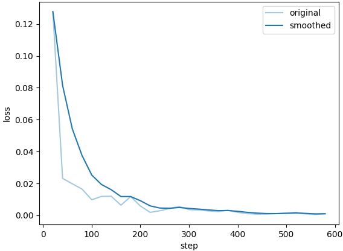

**Base Model Qwen2.5-7B-Base**  
- **Base Line**   
**On full_data_base_test_agda_eng_single (351)**   
    "predict_bleu-4": 51.19749373219373,  
    "predict_model_preparation_time": 0.0047,  
    "predict_rouge-1": 75.08338774928774,  
    "predict_rouge-2": 53.35914900284901,  
    "predict_rouge-l": 60.117741880341875,  
    "predict_runtime": 1310.4267,  
    "predict_samples_per_second": 0.268,  
    "predict_steps_per_second": 0.134  

- **Full Data with Agda and Single English Expressions Only (3154)**   
**Training**  
  
**Evaluation**  
**On full_data_test_agda_eng_single (351)：**  
    "predict_bleu-4": 98.61656381766382,  
    "predict_model_preparation_time": 0.0042,  
    "predict_rouge-1": 99.44990541310541,  
    "predict_rouge-2": 99.10784985754987,  
    "predict_rouge-l": 98.94666524216525,  
    "predict_runtime": 1005.1653,  
    "predict_samples_per_second": 0.349,  
    "predict_steps_per_second": 0.175  
**On full_data_test_agda_small (1000)：**  
    "predict_bleu-4": 94.8452257,  
    "predict_model_preparation_time": 0.0043,  
    "predict_rouge-1": 97.2225797,  
    "predict_rouge-2": 95.79734479999999,  
    "predict_rouge-l": 96.593594,  
    "predict_runtime": 3142.9208,  
    "predict_samples_per_second": 0.318,  
    "predict_steps_per_second": 0.159  

- **Full Data with Agda and all English Expressions (28656)**   
**Training**  
  
**Evaluation**  
**On full_data_test_agda_eng (3185)：**  
    "predict_bleu-4": 99.294073155416,  
    "predict_model_preparation_time": 0.0045,  
    "predict_rouge-1": 99.92347880690738,  
    "predict_rouge-2": 99.87280028257457,  
    "predict_rouge-l": 99.60355918367347,  
    "predict_runtime": 9995.9989,  
    "predict_samples_per_second": 0.319,  
    "predict_steps_per_second": 0.159  

---------------------------------------------------------------------
**Base Model Meta-Llama-3.1-8B**  
- **Base Line**  
N/A
- **Full Data with Agda and Single English Expressions Only (3154)**   
**Training**  
  
**Evaluation**  
**On full_data_test_agda_eng_single (351)：**  
    "predict_bleu-4": 98.66765099715099,  
    "predict_model_preparation_time": 0.005,  
    "predict_rouge-1": 99.42804558404558,  
    "predict_rouge-2": 99.09663304843305,  
    "predict_rouge-l": 98.93942934472933,  
    "predict_runtime": 1109.9474,  
    "predict_samples_per_second": 0.316,  
    "predict_steps_per_second": 0.159  
**On full_data_test_agda_small (1000)：**  